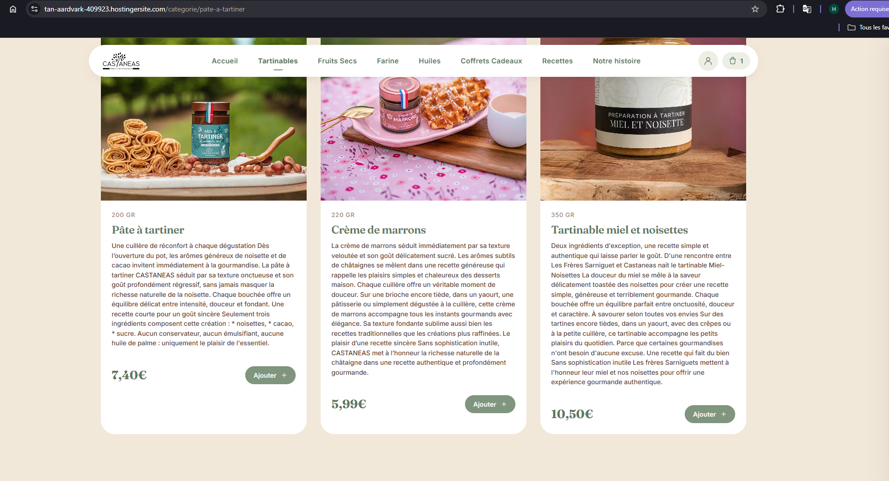

# Intégrations futures — Castaneas

## Paiement Up2pay Crédit Agricole

### Domaine actuel a declarer

La base URL de paiement a utiliser pour l'instant est :

`https://www.castaneas.fr`

Les URLs remontees a Up2pay depuis le code sont donc :

| Champ Up2pay | URL actuelle |
|---|---|
| `PBX_EFFECTUE` | `https://www.castaneas.fr/payment-return.php?status=paid&ref=...` |
| `PBX_REFUSE` | `https://www.castaneas.fr/payment-return.php?status=refused&ref=...` |
| `PBX_ANNULE` | `https://www.castaneas.fr/payment-return.php?status=cancelled&ref=...` |
| `PBX_REPONDRE_A` | `https://www.castaneas.fr/payment-notify.php?token=...` |

Attention : les URLs declarees chez Credit Agricole doivent pointer exactement vers ce domaine de production.

### Configuration requise

Le paiement ne demarre pas tant que ces valeurs ne sont pas renseignees :

- `base_url`
- `up2pay.site`
- `up2pay.rang`
- `up2pay.identifiant`
- `up2pay.hmac_key`
- `up2pay.gateway_url`

Valeurs recommandees :

- `up2pay.gateway_url` : `https://tpeweb.e-transactions.fr/php/`
- `up2pay.currency` : `978`
- `up2pay.language` : `FRA`
- `up2pay.hash_algo` : `SHA512`
- `up2pay.callback_secret` : secret long et aleatoire uniquement pour `payment-notify.php`
- `payment_simulate` : `false`

Exemple de configuration serveur :

```php
<?php

return [
  'base_url' => 'https://www.castaneas.fr',
  'payment_simulate' => false,
  'up2pay' => [
    'site' => 'VOTRE_SITE_UP2PAY',
    'rang' => 'VOTRE_RANG',
    'identifiant' => 'VOTRE_IDENTIFIANT',
    'hmac_key' => 'VOTRE_CLE_HMAC',
    'callback_secret' => 'UN_SECRET_LONG_ET_ALEATOIRE',
    'gateway_url' => 'https://tpeweb.e-transactions.fr/php/',
    'currency' => '978',
    'language' => 'FRA',
    'hash_algo' => 'SHA512',
  ],
];
```

### Comportement de securite

- Le retour navigateur `payment-return.php` ne marque plus une commande en `paid` a lui seul.
- Le passage a `paid` doit venir de `payment-notify.php` ou du mode simulation.
- Si `up2pay.callback_secret` est renseigne, `payment-notify.php` refuse les notifications sans le bon token.

### Checklist de mise en service

1. Recuperer les identifiants Up2pay de production : site, rang, identifiant, cle HMAC.
2. Declarer chez Credit Agricole les URLs de retour ci-dessus avec `https://www.castaneas.fr`.
3. Poser la configuration sur le serveur, sans activer `payment_simulate`.
4. Verifier que `payment-notify.php` est joignable publiquement en HTTPS sans redirection parasite.
5. Lancer un paiement reel ou un test bancaire, puis verifier qu'une commande passe de `pending_payment` a `paid` apres notification serveur.
6. Verifier apres mise en service qu'un retour navigateur arrive bien sur `confirmation.html?ref=...` puis qu'une notification serveur fait passer la commande de `pending_payment` a `paid`.

## 1. Sucrine CRM

### Objectif
Envoyer automatiquement chaque commande client vers le CRM Sucrine au moment de la confirmation de commande.

### API
- Base URL : `https://app.sucrine.club/api`
- Base URL test : `https://preview.app.sucrine.club/api`
- Auth : header `Authorization: ApiKey XXXX`
- Doc : https://developers.sucrineclub.com/api-reference/index.html

### Ce que l'API expose
| Endpoint | Usage |
|---|---|
| `POST /professional/customerOrders/order` | Créer une commande |
| `GET /professional/customerOrders` | Lister les commandes |
| `PUT /professional/customerOrders/{id}/cancel` | Annuler une commande |
| `POST/GET /professional/contacts` | Gérer les contacts clients |
| `GET /professional/catalogues/{catalogueId}/deliveryPoints` | Modes de livraison |

> ⚠️ Il n'existe **pas** d'endpoint pour lister les produits du catalogue. Les `catalogueItemPriceId` doivent être copiés manuellement depuis le dashboard Sucrine.

> ⚠️ La création de commande requiert aussi un `deliveryPoint` Sucrine valide. Il faut donc renseigner dans la config serveur soit `sucrine.delivery_point`, soit un mapping `sucrine.delivery_point_home` / `sucrine.delivery_point_relay`, soit de préférence un mapping exact `sucrine.delivery_points` par code de livraison Sendcloud.

### Mapping produits
Chaque produit Castaneas a maintenant un champ `sucrineId` dans le back-office (section **Intégrations** du formulaire produit). Ce champ correspond au `catalogueItemPriceId` dans Sucrine.

**Étapes :**
1. Se connecter au dashboard Sucrine
2. Pour chaque produit, copier son `catalogueItemPriceId`
3. Coller cet ID dans le champ **Référence Sucrine** du produit dans le back-office Castaneas
4. Récupérer l'identifiant du mode de distribution Sucrine utilisé pour les commandes web, puis le renseigner dans `sucrine.delivery_point` ou dans les variantes `home` / `relay`
5. Si plusieurs modes Sucrine existent selon le transporteur ou le type de livraison, remplir `sucrine.delivery_points` avec un mapping exact par code Sendcloud

Exemple recommande pour les modes de livraison :

```php
'sucrine' => [
  'api_key' => 'VOTRE_CLE_API_SUCRINE',
  'base_url' => 'https://app.sucrine.club/api',
  'order_source' => 'castaneas',
  'delivery_points' => [
    'chronopost:shop2shop' => 'ID_SUCRINE_RELAIS_CHRONO',
    'chronopost:relay' => 'ID_SUCRINE_RELAIS_CHRONO',
    'chronopost:home' => 'ID_SUCRINE_DOMICILE_CHRONO',
    'home' => 'ID_SUCRINE_DOMICILE_PAR_DEFAUT',
    'relay' => 'ID_SUCRINE_RELAIS_PAR_DEFAUT',
  ],
],
```

Clés testées automatiquement par le code, dans l'ordre :

- `shipping.code`
- `shipping.product.code`
- `carrier.code:product.code`
- `carrier.code:type`
- `carrier.code:last_mile`
- `carrier.code`
- `type`
- `last_mile`

### Proxy PHP (à créer sur Hostinger)
La clé API ne doit **jamais** être dans le JS client. Il faut un proxy côté serveur.

Fichier : `/public_html/proxy-sucrine.php`

```php
<?php
header('Content-Type: application/json');

$SUCRINE_API_KEY = 'VOTRE_CLE_API';
$SUCRINE_BASE    = 'https://app.sucrine.club/api';

$body = json_decode(file_get_contents('php://input'), true);

$ch = curl_init($SUCRINE_BASE . '/professional/customerOrders/order');
curl_setopt_array($ch, [
    CURLOPT_RETURNTRANSFER => true,
    CURLOPT_POST           => true,
    CURLOPT_POSTFIELDS     => json_encode($body),
    CURLOPT_HTTPHEADER     => [
        'Authorization: ApiKey ' . $SUCRINE_API_KEY,
        'Content-Type: application/json',
    ],
]);
$response = curl_exec($ch);
$status   = curl_getinfo($ch, CURLINFO_HTTP_CODE);
curl_close($ch);

http_response_code($status);
echo $response;
```

### Déclenchement (dans `confirmation.html`)
Au chargement de la page de confirmation, lire le panier sauvegardé et appeler le proxy :

```js
async function sendOrderToSucrine(cart, customer) {
  const items = {};
  cart.forEach(item => {
    if (item.sucrineId) items[item.sucrineId] = { quantity: item.qty };
  });

  await fetch('/proxy-sucrine.php', {
    method: 'POST',
    headers: { 'Content-Type': 'application/json' },
    body: JSON.stringify({
      newContact: {
        firstName: customer.firstName,
        lastName:  customer.lastName,
        email:     customer.email,
        phone:     customer.phone,
      },
      advancedCatalogueItems: items,
      deliveryAddress: { ...customer.address },
      invoicingAddress: { ...customer.address },
    }),
  });
}
```

---

## 2. Supabase — Auth client + historique commandes

### Objectif
Remplacer l'auth localStorage (login/register) par une vraie base de données, et permettre aux clients de voir leur historique de commandes.

### Stack
- **Supabase Auth** : email/password natif, JWT, sessions persistantes
- **Supabase DB** : table `orders` pour stocker les commandes passées

### Étapes d'implémentation

#### A. Créer le projet Supabase
1. https://supabase.com → nouveau projet
2. Récupérer : `SUPABASE_URL` et `SUPABASE_ANON_KEY`

#### B. Table `orders`
```sql
create table orders (
  id         uuid primary key default gen_random_uuid(),
  user_id    uuid references auth.users(id),
  created_at timestamptz default now(),
  status     text default 'pending',
  items      jsonb,
  total      numeric,
  address    jsonb,
  sucrine_order_id text
);
```

#### C. Modifier `login.html` et `register.html`
Remplacer le code localStorage actuel par le SDK Supabase :

```html
<script src="https://cdn.jsdelivr.net/npm/@supabase/supabase-js@2/dist/umd/supabase.min.js"></script>
```

```js
const supabase = supabase.createClient(SUPABASE_URL, SUPABASE_ANON_KEY);

// Register
const { data, error } = await supabase.auth.signUp({ email, password });

// Login
const { data, error } = await supabase.auth.signInWithPassword({ email, password });
```

#### D. Sauvegarder la commande (dans `confirmation.html`)
Après l'appel Sucrine, insérer en base :

```js
const { data: { user } } = await supabase.auth.getUser();
await supabase.from('orders').insert({
  user_id:         user?.id ?? null,
  items:           cart,
  total:           cartTotal,
  address:         customerAddress,
  sucrine_order_id: sucrineResponse.id,
});
```

#### E. Créer `mon-compte.html`
Page client affichant l'historique :

```js
const { data: orders } = await supabase
  .from('orders')
  .select('*')
  .order('created_at', { ascending: false });
```

### Sécurité Supabase
- Activer **Row Level Security (RLS)** sur la table `orders`
- Policy : un utilisateur ne voit que ses propres commandes
```sql
create policy "own orders" on orders
  for select using (auth.uid() = user_id);
```

---

## Ordre de priorité

1. **Obtenir la clé API Sucrine** + `catalogueItemPriceIds` depuis le dashboard
2. Renseigner les `sucrineId` dans le back-office (opération unique)
3. Créer `proxy-sucrine.php` sur Hostinger
4. Câbler `confirmation.html` → appel proxy
5. Créer le projet Supabase + modifier login/register
6. Créer `mon-compte.html` avec historique
